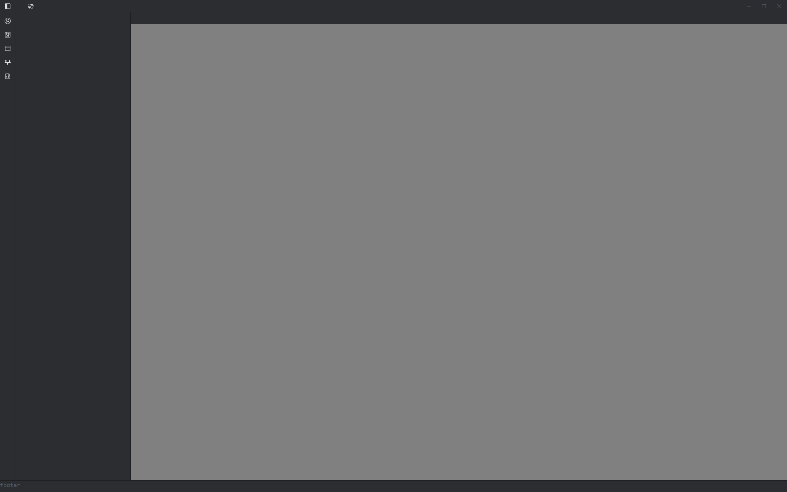
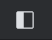
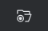
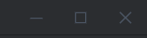
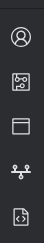
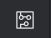
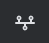
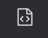
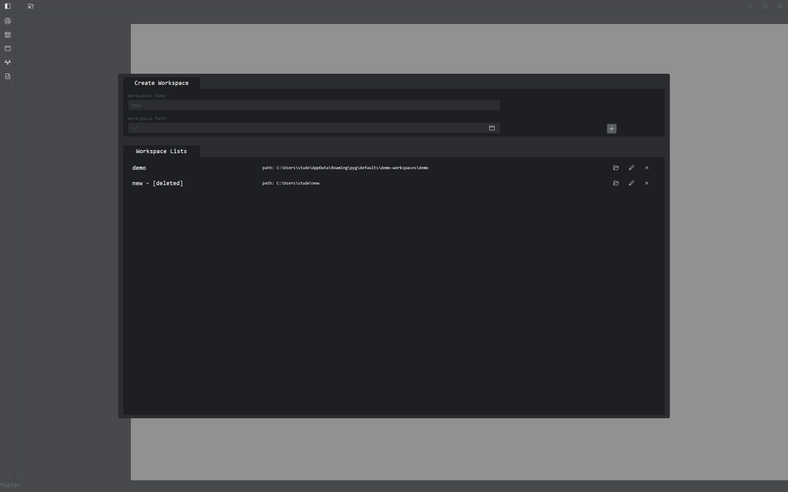
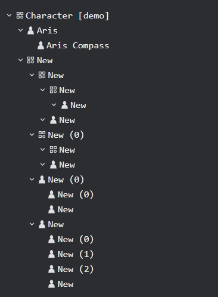

# TUTORIALS

## 기본 화면

> Plan Your Game 어플리케이션은 Workspace 단위로 작업을 분리하기에 게임 요소를 유형별로 묶어서 관리하고 있습니다

### 타이틀 바

 -  : 사이드 바 (Hierarchy View)를 열거나 닫는 버튼입니다
 -  : 작업 공간을 열거나 생성하기 위한 내부 창을 키는 버튼입니다
 -  : 커스텀 된 윈도우 창 버튼입니다

####

---

### 사이드 바

> 작업할 게임 요소 유형을 고르는 좌측 사이드바입니다

-  : `게임 요소 유형 - 스토리:캐릭터`를 선택하는 버튼입니다.
-  : `게임 요소 유형 - 스토리:플롯`를 선택하는 버튼입니다.
-  : `게임 요소 유형 - 스토리:씬`를 선택하는 버튼입니다.
-  : `게임 요소 유형 - 스토리:타임라인`를 선택하는 버튼입니다.
-  : `게임 요소 유형 - 기능:스크립트`를 선택하는 버튼입니다.

## 작업 공간 선택 화면

> 새로운 작업 공간 또는 기존의 작업 공간을 열기 위한 화면입니다

### 작업 공간 유틸리티 버튼

> 
현재 작업 공간 보호를 위해 수정/삭제 기능은 비활성화/미구현 상태입니다

 - : 작업공간을 열 수 있습니다. (작업 공간이 실질적으로 삭제된 경우 작동하지 않습니다)
 - : 작업공간과 관련된 정보를 수정할 수 있습니다. 
   - 
현재 보안 문제로 미구현 상태입니다

 - : 작업공간을 삭제합니다. 
   - 
현재 보안 문제로 비활성화 상태입니다

   - : 작업 공간이 실질적으로 존재할 경우 빨간색을 띱니다.
   - : 작업 공간이 실질적으로 삭제된 경우 회색을 띱니다.

## 요소 종속 트리 뷰

